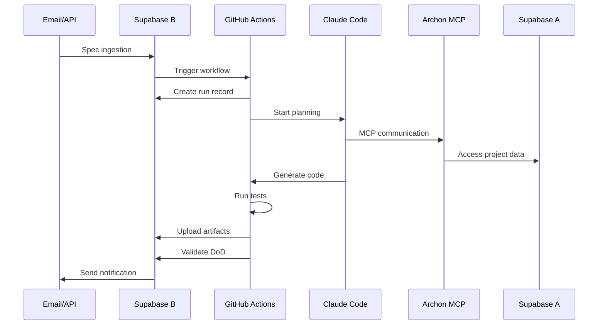

# AI Continuous Delivery System Architecture

## Overview

The AI Continuous Delivery System is a distributed architecture that automates software development from specification to deployment using AI agents and modern DevOps practices.

## Core Components

### 1. Ingestion Layer
- **Email Processing**: Gmail Push notifications trigger specification ingestion
- **API Gateway**: Direct API calls for immediate specification processing
- **Signed URLs**: Secure specification storage and retrieval

### 2. Control Plane (Supabase B)
- **Database**: PostgreSQL with Row Level Security (RLS)
- **Edge Functions**: Serverless functions for notifications and processing
- **Tables**: `specs`, `sprints`, `runs`, `artifacts`, `status_events`

### 3. Agent Layer
- **Archon MCP**: Model Context Protocol server (ports 8181/8051)
- **Claude Code**: Planning and development agent with MCP integration
- **AI Models**: Claude-3.5-Sonnet for planning, various models for testing

### 4. Execution Layer
- **GitHub Actions**: Self-hosted ARM64 runner
- **Testing Stack**: pytest (Python) + Playwright (E2E)
- **Artifact Management**: Reports, coverage, screenshots, videos

## Data Flow

## Infrastructure

### Network Topology
- **VPS**: swfs.niox.ovh (Ubuntu 22.04, ARM64)
- **Docker**: Container orchestration for services
- **Ports**: 
  - 8181: Archon API
  - 8051: Archon MCP
  - 8000: Test application server

### Security
- **RLS Policies**: Row-level security on all database tables
- **Service Keys**: Separate authentication for different components
- **Signed URLs**: Temporary access to specifications and artifacts
- **Environment Isolation**: Separate Supabase projects for different concerns

## Scalability Considerations

### Horizontal Scaling
- Multiple GitHub Actions runners can be deployed
- Supabase Edge Functions auto-scale
- Archon MCP can be load-balanced

### Performance
- Parallel test execution with Playwright
- Efficient database queries with proper indexing
- Artifact compression and CDN delivery

## Monitoring and Observability

### Status Tracking
- Real-time status events in database
- GitHub Actions workflow logs
- Test reports and artifacts

### Metrics
- Run success/failure rates
- Test coverage percentages
- Pipeline execution times
- Definition of Done compliance