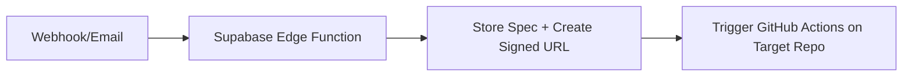
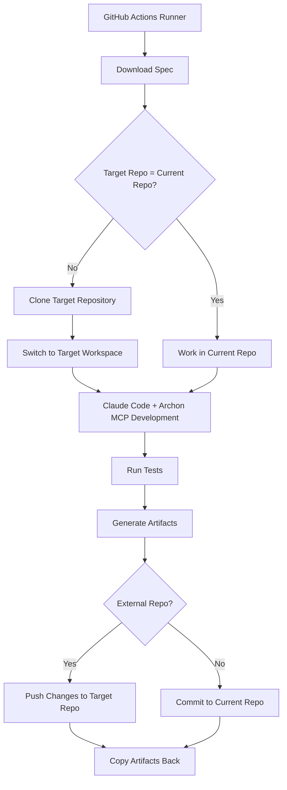

# Multi-Project Support Documentation

The AI Continuous Delivery system now supports developing code for multiple repositories and projects, not just the control-plane repository.

## 🎯 **Key Capabilities**

### 1. **Simple Webhook Trigger** (Alternative to Gmail)
- **URL**: `https://your-project.supabase.co/functions/v1/simple-webhook`
- **Method**: POST
- **Purpose**: Trigger workflows for any repository with a simple HTTP request

### 2. **Multi-Repository Development**
- Develop code for **any GitHub repository** from the central control-plane
- Clone external repositories during workflow execution
- Commit and push changes to target repositories
- Support for both new and existing projects

### 3. **Project Context Management**
- Each spec can target a specific repository and branch
- Project-specific configurations and requirements
- Isolated workspaces for different projects

## 🚀 **Simple Webhook Usage**

### Basic Usage
```bash
curl -X POST https://your-project.supabase.co/functions/v1/simple-webhook \
  -H "Content-Type: application/json" \
  -d '{
    "repo": "user/my-project",
    "branch": "main",
    "spec_yaml": "meta:\n  project: my-app\n  repo: user/my-project\n..."
  }'
```

### Using the Multi-Project Client
```bash
# Install and use the client script
./scripts/multi-project-webhook.py user/my-project spec.yaml --project "My App"

# For existing projects with feature branches
./scripts/multi-project-webhook.py user/existing-app feature-spec.yaml \
  --branch feature/new-feature \
  --email developer@company.com
```

### Webhook Payload Format
```json
{
  "repo": "user/project-name",        // Required: Target repository
  "branch": "main",                   // Optional: Target branch (default: main)
  "spec_yaml": "...",                 // Required: YAML specification content
  "requester_email": "user@email.com", // Optional: Who requested this
  "project_name": "My Project"        // Optional: Human-readable name
}
```

### Response Format
```json
{
  "success": true,
  "spec_id": "uuid",
  "repo": "user/project-name", 
  "branch": "main",
  "workflow_triggered": true,
  "message": "Specification processed and workflow triggered"
}
```

## 🏗️ **How Multi-Project Development Works**

### 1. **Workflow Trigger**


### 2. **Development Process**


### 3. **Repository Workspace Management**
- **Current Repo Mode**: Development happens in the control-plane repository
- **External Repo Mode**: Target repository cloned to `/tmp/workspace-{repo}-{pid}`
- **Artifact Handling**: Results always copied back to control-plane for reporting

## 📋 **Specification Format for Multi-Project**

### Basic Multi-Project Spec
```yaml
meta:
  project: "My New App"
  repo: "user/my-new-app"           # Target repository
  requester_email: "dev@company.com"

planning:
  epics:
    - id: E1
      title: "Initial MVP"
      sprints:
        - id: S1
          goals: ["Create basic structure", "Add authentication"]
          user_stories:
            - id: US1
              as: "user"
              want: "to register and login"
              so_that: "I can access the application"
              acceptance:
                - "Registration form works"
                - "Login authentication functional"
          dod:
            coverage_min: 0.75
            e2e_pass: true

runtime:
  stack:
    backend: "Python 3.11 + FastAPI"
    frontend: "React + TypeScript"
    database: "PostgreSQL"

tests:
  unit: "pytest"
  e2e: "Playwright"

policies:
  coding_standards: "Black, ESLint, TypeScript strict"
  branch: "feature/ai-generated-*"
```

### Working with Existing Projects
```yaml
meta:
  project: "Feature Enhancement" 
  repo: "company/existing-app"      # Existing repository
  branch: "develop"                 # Work from develop branch

planning:
  epics:
    - id: E1
      title: "Add Payment Integration"
      sprints:
        - id: S1
          goals: ["Integrate Stripe", "Add payment UI"]
          user_stories:
            - id: US1
              as: "customer"
              want: "to pay securely"
              so_that: "I can complete purchases"

# The system will:
# 1. Clone company/existing-app
# 2. Checkout from 'develop' branch  
# 3. Create feature/ai-generated-* branch
# 4. Develop the payment integration
# 5. Push changes back to company/existing-app
```

## 🔧 **Environment Variables for Multi-Project**

### GitHub Actions Workflow
```yaml
env:
  # Multi-project support
  TARGET_REPO: ${{ github.event.client_payload.repo || github.repository }}
  TARGET_BRANCH: ${{ github.event.client_payload.branch || 'main' }}
  PROJECT_NAME: ${{ github.event.client_payload.project_name || github.repository }}
  
  # Required for external repo access
  GITHUB_TOKEN: ${{ secrets.GITHUB_TOKEN }}
```

### Script Configuration
- `TARGET_REPO`: Repository to develop for (default: current repository)
- `TARGET_BRANCH`: Branch to base development on (default: main)
- `PROJECT_NAME`: Human-readable project name
- `GITHUB_TOKEN`: Required for cloning/pushing to external repositories

## 🔐 **Security Considerations**

### Repository Access
- **GitHub Token**: Must have access to target repositories
- **Fine-grained PAT**: Recommended with repository-specific permissions
- **Organization Settings**: May need approval for external repositories

### Workspace Isolation
- External repositories cloned to temporary directories (`/tmp/workspace-*`)
- Separate git configuration for AI commits
- Artifacts copied back to control-plane for security

### Access Control
- Webhook endpoint should be protected (authentication/rate limiting)
- Validate repository ownership before processing
- Log all multi-project operations for audit

## 🧪 **Testing Multi-Project Setup**

### Test with Current Repository
```bash
./scripts/multi-project-webhook.py ljniox/ai-continuous-delivery test-spec.yaml \
  --project "Test Project" \
  --email "test@example.com"
```

### Test with External Repository
```bash
./scripts/multi-project-webhook.py user/test-repo test-spec.yaml \
  --branch develop \
  --project "External Test"
```

### Environment Variable Test
```bash
export AI_CD_WEBHOOK_URL="https://your-project.supabase.co/functions/v1/simple-webhook"
./scripts/multi-project-webhook.py user/project spec.yaml
```

## 📊 **Monitoring Multi-Project Operations**

### Database Tracking
- All specs stored with target repository information
- Status events include repository context
- Artifacts linked to specific projects

### Logging
- Webhook calls logged with target repository
- Clone operations and workspace paths logged
- Push operations results tracked

### Metrics
- Success rates by repository
- Development time per project type
- External vs. internal repository performance

## 🎯 **Use Cases**

### 1. **Client Project Development**
- Receive requirements via webhook
- Develop in client's repository
- Deliver working code with tests

### 2. **Internal Tool Creation**
- Quick MVP development for internal tools
- Standardized project structure
- Automated testing and deployment

### 3. **Feature Development**
- Add features to existing applications
- Maintain existing codebase patterns
- Integrate with existing CI/CD

### 4. **Prototype Development**
- Rapid prototyping for new ideas
- Isolated development environment
- Easy handoff to development teams

## 🔄 **Migration from Email to Webhook**

### Advantages of Webhook Approach
- ✅ **Simpler setup**: No Gmail API, OAuth, or Pub/Sub configuration
- ✅ **Reliable**: Direct HTTP calls, no dependency on external services
- ✅ **Flexible**: Easy integration with any system or API
- ✅ **Immediate**: No polling or push notification delays
- ✅ **Testable**: Easy to test with curl or HTTP clients

### Migration Steps
1. **Deploy simple webhook**: `supabase functions deploy simple-webhook`
2. **Test webhook**: Use curl or multi-project client
3. **Update integrations**: Switch from email to webhook calls
4. **Deprecate Gmail setup**: Remove Gmail API dependencies (optional)

The webhook approach provides a much simpler and more reliable trigger mechanism while maintaining all the existing capabilities for multi-project development.