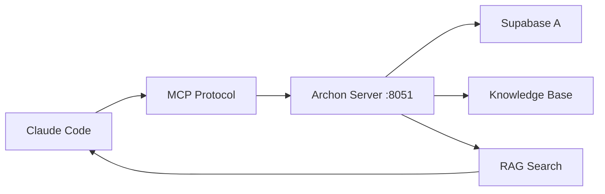

# Archon Integration Guide

Complete guide for setting up and using Archon as the MCP server for AI Continuous Delivery system.

## 🏛️ What is Archon?

Archon is a "command center for AI coding assistants" that serves as a Model Context Protocol (MCP) server. It provides:

- **Knowledge Management**: Web crawling, document processing, semantic search
- **AI Integration**: Multiple LLM support with 10 MCP tools for RAG queries
- **Project Management**: Hierarchical task tracking and collaborative editing
- **Context Sharing**: Centralized context across AI agents

## 🔧 Architecture Integration

### Current Setup
- **Supabase A**: Archon data storage (knowledge base, projects, tasks)
- **Supabase B**: Control-plane (specs, sprints, runs, artifacts) 
- **Archon Container**: Docker container with MCP server on ports 8181/8051
- **Claude Code**: Connects via MCP to leverage Archon's capabilities

### Data Flow


## 🚀 Quick Setup

### 1. Initialize Archon
```bash
# Run the initialization script
./ops/archon/init-archon.sh
```

This script will:
- Start Archon Docker container
- Configure environment variables
- Initialize knowledge base with project documentation
- Create MCP configuration for Claude Code
- Verify all connections

### 2. Configure Secrets
Add these secrets to your GitHub repository:

```bash
# Supabase A (Archon storage)
SUPABASE_A_URL=https://your-archon-project.supabase.co
SUPABASE_A_SERVICE_KEY=your-service-key

# AI Model Keys (optional - can configure via UI)
ANTHROPIC_API_KEY=your-anthropic-key
OPENAI_API_KEY=your-openai-key
```

### 3. Access Archon Web UI
- **URL**: http://localhost:8181
- **Configure AI models** in the settings
- **Upload additional documents** to knowledge base
- **Create projects** for better organization

## 🔌 MCP Integration Details

### Connection Configuration
The system automatically creates `mcp-config.json`:

```json
{
  "mcpServers": {
    "archon": {
      "transport": {
        "type": "sse", 
        "url": "http://localhost:8051"
      },
      "capabilities": ["tools", "resources", "prompts"]
    }
  }
}
```

### Available MCP Tools
Archon provides these tools to Claude Code:

1. **RAG Search**: `archon_search_knowledge`
2. **Document Management**: `archon_add_document` 
3. **Project Management**: `archon_create_project`
4. **Task Management**: `archon_create_task`
5. **Code Analysis**: `archon_analyze_code`
6. **Template Generation**: `archon_get_templates`

### Usage in Claude Code
```bash
# Claude Code automatically uses MCP tools when available
claude run --mcp-config mcp-config.json "
  Use Archon to search for similar projects and create a new FastAPI application
"
```

## 📚 Knowledge Management

### Automatic Knowledge Base Population
The initialization script automatically adds:

- **Project README.md** - System overview
- **CLAUDE.md** - Complete implementation history  
- **Documentation files** - All markdown files from docs/
- **Specification files** - YAML specs from processed projects

### Manual Knowledge Addition
```bash
# Via API
curl -X POST http://localhost:8181/api/knowledge/documents \
  -H "Content-Type: application/json" \
  -d '{
    "title": "Custom Document",
    "content": "Document content here...",
    "type": "documentation",
    "tags": ["custom", "example"]
  }'

# Via Web UI
# Navigate to http://localhost:8181/knowledge
# Upload files or add content directly
```

### Search Capabilities
```bash
# Search via API
curl -X POST http://localhost:8181/api/rag/search \
  -H "Content-Type: application/json" \
  -d '{
    "query": "FastAPI authentication patterns",
    "limit": 5
  }'
```

## 🎯 Enhanced Claude Code Capabilities

### Before Archon Integration
Claude Code worked in isolation:
- Limited to current project context
- No historical knowledge
- Basic template generation

### With Archon Integration  
Claude Code now has access to:
- **Accumulated knowledge** from all previous projects
- **RAG-based context retrieval** for similar problems
- **Pattern recognition** across project history
- **Enhanced template generation** from knowledge base
- **Collaborative project tracking**

### Example Enhanced Workflow
```bash
# Claude Code with Archon automatically:
# 1. Searches knowledge base for similar projects
# 2. Retrieves relevant patterns and templates  
# 3. Analyzes specification against historical data
# 4. Generates code using proven patterns
# 5. Updates project knowledge for future use
```

## 🔧 Configuration Options

### Docker Compose Environment
```yaml
# ops/archon/docker-compose.yml
environment:
  # Core configuration  
  SUPABASE_URL: ${SUPABASE_A_URL}
  SUPABASE_SERVICE_KEY: ${SUPABASE_A_SERVICE_KEY}
  
  # AI Models
  ANTHROPIC_API_KEY: ${ANTHROPIC_API_KEY}
  OPENAI_API_KEY: ${OPENAI_API_KEY}
  
  # MCP Server
  MCP_SERVER_PORT: 8051
  MCP_TRANSPORT: sse
  
  # Knowledge Management
  ENABLE_WEB_CRAWLING: true
  ENABLE_VECTOR_SEARCH: true
```

### Performance Tuning
```yaml
# Resource limits
deploy:
  resources:
    limits:
      memory: 2G
      cpus: '1.0'
    reservations: 
      memory: 512M
      cpus: '0.25'
```

## 🧪 Testing Archon Integration

### Health Checks
```bash
# Test Archon API
curl http://localhost:8181/health

# Test MCP Server  
curl http://localhost:8051

# Test knowledge search
curl -X POST http://localhost:8181/api/rag/search \
  -H "Content-Type: application/json" \
  -d '{"query": "test", "limit": 1}'
```

### Integration Test
```bash
# Test complete Claude Code + Archon flow
claude run --mcp-config mcp-config.json "
  Search Archon knowledge base for FastAPI examples,
  then create a simple API with authentication
"
```

### Knowledge Base Verification
1. Open http://localhost:8181/knowledge
2. Verify documents are loaded
3. Test search functionality
4. Check project organization

## 🔍 Troubleshooting

### Common Issues

#### 1. Archon Container Won't Start
```bash
# Check logs
docker-compose -f ops/archon/docker-compose.yml logs archon

# Check environment
cat ops/archon/.env

# Restart container
docker-compose -f ops/archon/docker-compose.yml restart archon
```

#### 2. MCP Connection Fails
```bash
# Verify MCP server is running
curl http://localhost:8051

# Check MCP configuration
cat mcp-config.json

# Test Claude Code MCP connection
claude --version
claude run --mcp-config mcp-config.json "test connection"
```

#### 3. Knowledge Base Empty
```bash
# Re-run initialization
./ops/archon/init-archon.sh

# Manually add documents via API
curl -X POST http://localhost:8181/api/knowledge/documents \
  -H "Content-Type: application/json" \
  -d '{"title": "Test", "content": "Test content", "type": "test"}'
```

#### 4. RAG Search Not Working  
```bash
# Check vector search is enabled
curl http://localhost:8181/api/settings

# Rebuild search index
curl -X POST http://localhost:8181/api/knowledge/reindex

# Test search directly
curl -X POST http://localhost:8181/api/rag/search \
  -H "Content-Type: application/json" \
  -d '{"query": "simple test", "limit": 1}'
```

## 🎯 Best Practices

### Knowledge Management
- **Regular Updates**: Add new project learnings to knowledge base
- **Good Tagging**: Use consistent tags for better search results
- **Documentation**: Include both successes and failures for learning
- **Cleanup**: Periodically review and organize knowledge base

### MCP Integration
- **Always test MCP connection** before running workflows
- **Use specific queries** for better RAG search results
- **Leverage project context** in Claude Code prompts
- **Monitor resource usage** of Archon container

### Security
- **Isolate Archon network** from external access
- **Secure API keys** in environment variables only
- **Regular backups** of knowledge base via Supabase
- **Monitor access logs** for unusual activity

## 🔄 Maintenance

### Regular Tasks
- **Weekly**: Check Archon container health and logs
- **Monthly**: Update Archon image to latest version
- **Quarterly**: Review and optimize knowledge base organization

### Updates
```bash
# Update Archon image
docker-compose -f ops/archon/docker-compose.yml pull archon
docker-compose -f ops/archon/docker-compose.yml up -d archon

# Backup knowledge base
# (Automatic via Supabase, but verify regularly)
```

This integration transforms Claude Code from a standalone tool into an intelligent agent with accumulated project knowledge and pattern recognition capabilities.