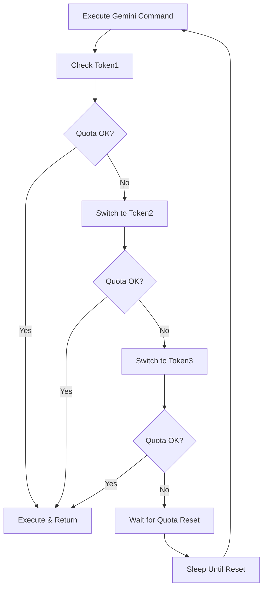

# Gemini AI Integration with Token Fallback

Complete guide for integrating Google Gemini AI with 3-token fallback system and Archon knowledge enhancement.

## 🎯 Overview

**Gemini AI replaces Qwen** in the testing phase with:
- **3-Token Fallback System**: Automatic rotation across multiple Gemini API keys
- **Quota Management**: Smart handling of API limits and quotas  
- **Archon Integration**: Knowledge-enhanced testing analysis
- **Session Continuity**: Resume interrupted analysis sessions

## 🔧 Setup Instructions

### Step 1: Obtain Gemini API Tokens

1. **Visit Google AI Studio**: https://makersuite.google.com/app/apikey
2. **Create 3 separate API keys** (recommended for high availability)
3. **Enable Gemini API** for each project
4. **Note quotas and limits** for each token

### Step 2: Configure Token Fallback System

```bash
# Initialize Gemini token configuration
bash scripts/gemini_limit_handler.sh init

# This creates ops/gemini_tokens.json with 3 token slots
```

**Manual Configuration:**
```bash
# Edit the configuration file
nano ops/gemini_tokens.json

# Replace REPLACE_WITH_TOKEN_X with your actual tokens:
{
  "tokens": [
    {
      "id": "token1",
      "value": "AIzaSyC..._YOUR_FIRST_TOKEN", 
      "status": "active",
      "description": "Primary Gemini API token"
    },
    {
      "id": "token2", 
      "value": "AIzaSyD..._YOUR_SECOND_TOKEN",
      "status": "active", 
      "description": "Secondary Gemini API token"
    },
    {
      "id": "token3",
      "value": "AIzaSyE..._YOUR_THIRD_TOKEN",
      "status": "active",
      "description": "Tertiary Gemini API token"
    }
  ]
}
```

### Step 3: GitHub Secrets Configuration

Add these secrets to your GitHub repository:

```bash
# Repository Settings > Secrets and Variables > Actions
GEMINI_TOKEN_1=AIzaSyC..._YOUR_FIRST_TOKEN
GEMINI_TOKEN_2=AIzaSyD..._YOUR_SECOND_TOKEN  
GEMINI_TOKEN_3=AIzaSyE..._YOUR_THIRD_TOKEN
```

### Step 4: Install Gemini CLI

```bash
# Option 1: npm (global)
npm install -g @google/generative-ai-cli

# Option 2: Python 
pip install google-generativeai

# Option 3: Auto-install in workflow (included)
```

## 🚀 Usage

### Automatic Integration

Your CI/CD workflow now automatically:
1. **Configures all 3 tokens** from GitHub secrets
2. **Installs Gemini CLI** if not available  
3. **Executes tests with AI analysis**
4. **Rotates tokens on quota limits**
5. **Resumes sessions on interruptions**

### Manual Commands

```bash
# Check token status
bash scripts/gemini_limit_handler.sh status

# Test connection with current token
bash scripts/gemini_limit_handler.sh test

# Execute command with automatic fallback
bash scripts/gemini_limit_handler.sh execute gemini "analyze this code"

# Switch to specific token manually
bash scripts/gemini_limit_handler.sh switch token2

# Resume interrupted session
bash scripts/resume_gemini_session.sh
```

### Direct Testing Integration

```bash
# Run tests with Gemini AI analysis
bash scripts/gemini_run_tests.sh

# This automatically:
# - Analyzes project with Archon context
# - Runs tests with AI-enhanced strategy
# - Provides post-test recommendations
# - Updates knowledge base with findings
```

## 🔄 Token Fallback Flow



## 🏛️ Archon Integration Features

### Enhanced Test Analysis

The system uses **Archon's knowledge base** to provide:

1. **Pre-Test Analysis**:
   - Search for similar project patterns
   - Recommend test strategies based on history
   - Identify critical areas for testing focus

2. **Intelligent Test Generation**:
   - Create tests based on project specification
   - Use proven patterns from knowledge base
   - Generate edge cases from similar projects

3. **Post-Test Insights**:
   - Compare results against DoD criteria
   - Provide improvement recommendations
   - Update knowledge base with new learnings

### Knowledge Base Integration

```bash
# Archon automatically:
# 1. Searches for relevant testing patterns
# 2. Enhances Gemini prompts with context
# 3. Stores analysis results for future use
# 4. Builds testing knowledge over time
```

## 📊 Monitoring & Management

### Token Usage Tracking

```bash
# View current usage
bash scripts/gemini_limit_handler.sh status

# Output:
# Current token: token1
# Available tokens:
#   token1: active (Primary) - Used: 45 times
#   token2: active (Secondary) - Used: 12 times  
#   token3: active (Tertiary) - Used: 3 times
```

### Session State Management

```bash
# Check active sessions
cat artifacts/gemini_session_state.json

# View resume logs
cat artifacts/gemini_resume.log

# Monitor token rotation
grep "Switching to" logs/gemini_tests.log
```

## 🛠️ Configuration Options

### Quota Management

```bash
# In gemini_limit_handler.sh:
RETRY_DELAY=60        # Seconds between retry attempts
MAX_RETRIES=3         # Maximum retries per token
MAX_WAIT_TIME=7200    # Maximum wait for quota reset (2 hours)
```

### Analysis Enhancement

```bash
# Customize analysis depth in gemini_run_tests.sh:
ANALYSIS_DEPTH="detailed"     # basic, detailed, comprehensive
ARCHON_INTEGRATION="enabled"  # enabled, disabled
KNOWLEDGE_UPDATE="auto"       # auto, manual, disabled
```

## 🚨 Troubleshooting

### Common Issues

**1. Token Authentication Errors**
```bash
# Verify token validity
curl -H "Authorization: Bearer AIzaSy..." \
     "https://generativelanguage.googleapis.com/v1/models"

# Check token in configuration
jq '.tokens[0].value' ops/gemini_tokens.json
```

**2. Quota Exceeded on All Tokens**
```bash
# Check quota status for each token
bash scripts/gemini_limit_handler.sh status

# Wait for quota reset (automatic)
# Or manually set reset time in configuration
```

**3. Analysis Not Generated**
```bash
# Check Gemini CLI installation
which gemini

# Test direct execution
export GEMINI_API_KEY="your_token"
gemini "test prompt"

# Check for prompt file issues
cat artifacts/test_analysis_prompt.md
```

### Recovery Procedures

**Reset Token Configuration**
```bash
# Backup current config
cp ops/gemini_tokens.json ops/gemini_tokens.json.backup

# Reinitialize
rm ops/gemini_tokens.json
bash scripts/gemini_limit_handler.sh init

# Restore tokens manually
```

**Clear Session State**
```bash
# Remove all session data
rm -f artifacts/gemini_session_state.json
rm -f artifacts/*analysis*.txt
rm -f artifacts/*prompt*.md
```

**Force Token Rotation**
```bash
# Manually rotate to next token
CURRENT=$(bash scripts/gemini_limit_handler.sh status | grep "Current" | cut -d: -f2 | tr -d ' ')
bash scripts/gemini_limit_handler.sh switch token2 "manual_rotation"
```

## 📈 Performance Optimization

### Token Distribution Strategy

```json
{
  "strategy": "round_robin",
  "load_balancing": {
    "token1": "heavy_analysis", 
    "token2": "medium_testing",
    "token3": "light_monitoring"
  },
  "quota_awareness": true
}
```

### Archon Context Optimization

```bash
# Limit Archon search results for faster processing
ARCHON_SEARCH_LIMIT=3

# Cache frequently used patterns
ARCHON_CACHE_ENABLED=true

# Async knowledge base updates
ARCHON_ASYNC_UPDATES=true
```

## 🔒 Security Best Practices

### Token Security

1. **Never commit tokens** to version control
2. **Use GitHub secrets** for CI/CD environments  
3. **Rotate tokens regularly** (quarterly recommended)
4. **Monitor token usage** for anomalies
5. **Restrict token permissions** to minimum required

### Session Security

1. **Session state files** contain project information
2. **Stored in artifacts/** (excluded from git)
3. **Automatically cleaned** on completion
4. **Monitor for sensitive data** in analysis outputs

## 📚 Integration Examples

### Custom Analysis Prompts

```bash
# Create custom analysis prompt
cat > custom_analysis.md << 'EOF'
# Custom Test Analysis

Analyze this Python project for:
1. Security vulnerabilities in authentication
2. Performance bottlenecks in database queries
3. Test coverage for critical business logic

Use Archon knowledge base for similar project patterns.
EOF

# Execute with Gemini
bash scripts/gemini_limit_handler.sh execute gemini "$(cat custom_analysis.md)"
```

### Enhanced CI/CD Pipeline

```yaml
# .github/workflows/enhanced-testing.yml
- name: Enhanced Gemini Testing
  env:
    GEMINI_TOKEN_1: ${{ secrets.GEMINI_TOKEN_1 }}
    GEMINI_TOKEN_2: ${{ secrets.GEMINI_TOKEN_2 }}
    GEMINI_TOKEN_3: ${{ secrets.GEMINI_TOKEN_3 }}
    ARCHON_ANALYSIS_DEPTH: "comprehensive"
  run: |
    # Configure tokens
    bash scripts/gemini_limit_handler.sh init
    
    # Run enhanced testing
    bash scripts/gemini_run_tests.sh
    
    # Upload enhanced results
    - uses: actions/upload-artifact@v3
      with:
        name: gemini-analysis
        path: |
          artifacts/gemini_post_analysis.txt
          artifacts/test_analysis.txt
          artifacts/summary.json
```

This comprehensive Gemini integration provides resilient AI-powered testing with intelligent fallback mechanisms and Archon knowledge enhancement for your AI Continuous Delivery system.